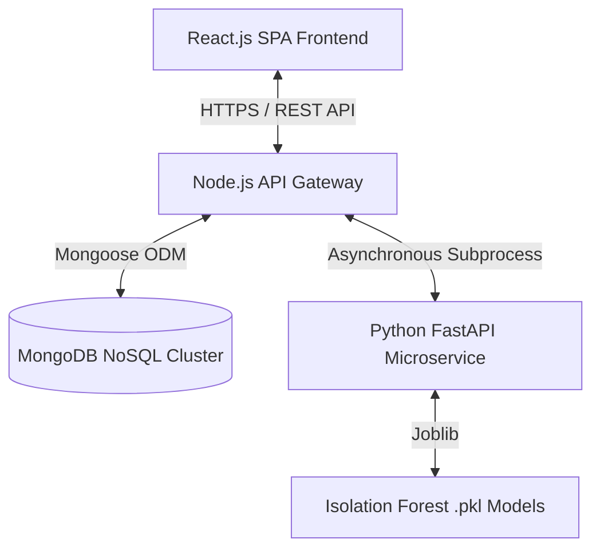
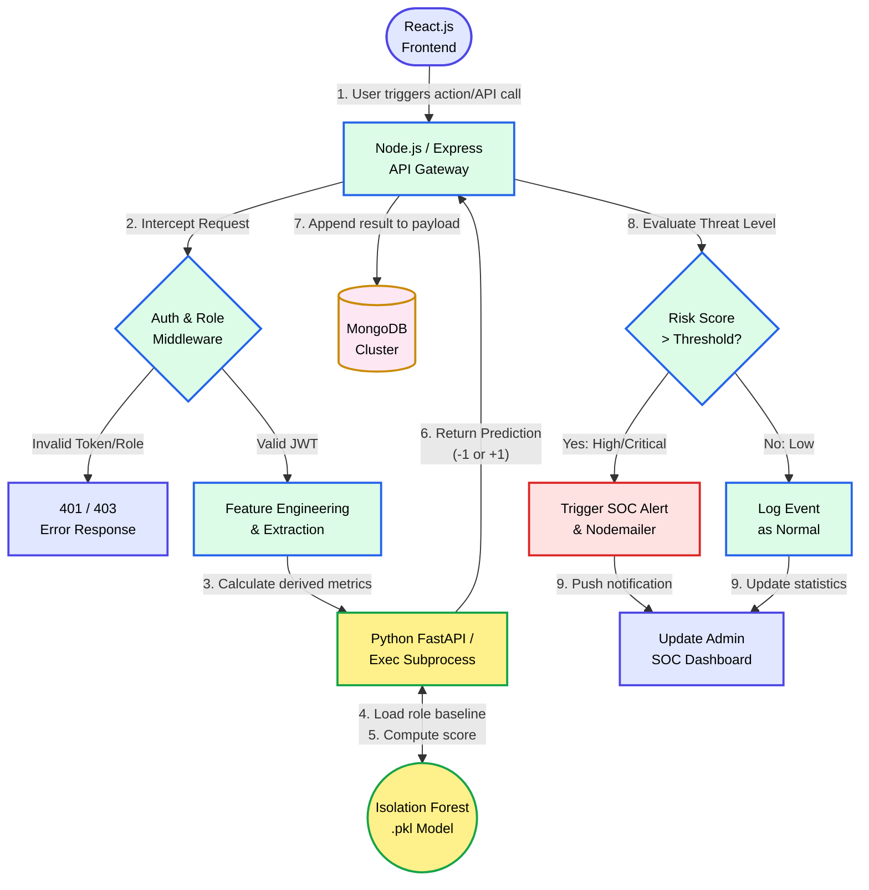

# Cloud User Behavioural Analytics (UBA) Using Python and ML

---

## 🚀 Project Overview

Traditional perimeter-centric cybersecurity architectures are becoming fundamentally obsolete as digital transformation pushes enterprise data into elastic cloud infrastructures. Attackers frequently bypass static firewalls by leveraging compromised credentials and "living off the land" techniques to execute stealthy data exfiltration.

This project implements a highly scalable, **cloud-native User Behavioural Analytics (UBA) platform** designed to autonomously detect and prevent insider threats and account takeovers. By monitoring user actions post-authentication, the system shifts security from a **"Trust but Verify"** model to a mathematically rigorous **Zero Trust** paradigm.

---

## 🏗️ System Architecture

The platform utilizes a **fully decoupled microservices architecture** to isolate high-concurrency web tasks from computationally intensive machine learning inference.

### High-Level Architecture

## 🔄 End-to-End Workflow

- **Ingestion:** The Node.js gateway captures multi-source telemetry including spatial, temporal, and volumetric data.  

- **Feature Engineering:** Python scripts translate unstructured JSON logs into 25-dimensional numerical feature vectors.  

- **Inference:** The Isolation Forest algorithm evaluates vectors, calculating path lengths to isolate anomalies that are statistically "few and different".  

- **Response:** High-risk scores trigger immediate SOC alerts, dashboard notifications, and Nodemailer security warnings.  

---

### Workflow Diagram

## 📌 Workflow Steps Breakdown

- **Ingestion:** The process begins when a user triggers an action at the React.js frontend.  

- **Interception:** The Node.js API Gateway captures the request and routes it through authentication and role-based middleware to verify the JWT.  

- **Feature Engineering:** Valid requests are processed to extract structured features such as temporal patterns and activity metrics.  

- **Inference:** A Python subprocess loads the role-specific Isolation Forest model and computes anomaly scores based on behavioral deviation.  

- **Persistence:** The prediction results are stored in MongoDB to maintain a complete audit trail of user activity.  

- **Threat Evaluation:** The system evaluates whether the computed risk score exceeds predefined thresholds.  

- **Alerting:** High-risk events trigger SOC alerts and email notifications, while low-risk events are logged as normal activity.  

- **Visualization:** All processed events are reflected in the admin dashboard with real-time analytics and monitoring updates.  

---

## ✨ Key Features

- **Role-Based Access Control (RBAC):** Strict middleware-enforced separation between User and Admin interfaces.  

- **Unsupervised ML Engine:** Utilizes role-specific Isolation Forest models that establish behavioral baselines without needing labeled attack data.  

- **Zero Trust Enforcement:** Integrates stateless JWT management with stateful database cross-referencing for instant session revocation.  

- **Real-Time Monitoring:** Dynamic React-based dashboards featuring circular risk score indicators and chronological activity timelines.  

- **Self-Cleaning Architecture:** Automated Time-To-Live (TTL) indexes permanently purge expired OTPs and session tokens.  

---

## 🛠️ Technology Stack

| Domain        | Technology                          | Purpose |
|--------------|------------------------------------|---------|
| Frontend     | React.js, Vite, Tailwind CSS       | High-speed UI rendering and responsive styling |
| Backend      | Node.js, Express.js                | Concurrent event-driven API gateway |
| Database     | MongoDB, Mongoose                  | NoSQL persistence with strict schema validation |
| ML Engine    | Python, FastAPI                    | Asynchronous machine learning inference |
| Data Science | Scikit-learn, Pandas, NumPy        | Anomaly detection and feature engineering |

---

## 🛡️ Security & Risk Mitigation (STRIDE Model)

The platform was engineered using the **STRIDE threat modeling framework** to ensure strong defensive depth:

- **Spoofing:** Mitigated via cryptographically signed JWTs and multi-factor OTP verification.  

- **Tampering:** Neutralized through TLS encryption in transit and Mongoose strict schema validation to prevent NoSQL injection.  

- **Information Disclosure:** All sensitive data is protected using bcrypt hashing (10 salt rounds) along with UI data masking utilities.  

- **Denial of Service:** Controlled by isolating ML workloads using Node.js asynchronous execution processes and implementing Redis-backed rate limiting.  

---

## ⚙️ Implementation Highlights

- **IPC Bridge:** Secure inter-process communication between Node.js and Python via standard I/O streams using the `child_process` module.  

- **Resilient Connectivity:** Recursive database connection pooling with retry logic to handle transient network failures.  

- **Memory Optimization:** Manual garbage collection and proper Chart.js instance destruction to prevent browser memory leaks during continuous monitoring.  

- **Email Failsafes:** Asynchronous SMTP handling wrapped in safe Promise catch blocks to maintain system stability during mail server delays.  

---

## 📊 Empirical Results

Tested against a dataset of **4,000 unique user profiles** with **101 injected anomalies**, the system achieved:

- **F1-Score:** Flawless **1.0 (100%)** on research data  
- **False Positive Rate:** **0%**, effectively eliminating SOC alert fatigue  
- **End-to-End Latency:** Average detection resolves in **294 milliseconds**  

---

## 🔮 Future Roadmap

- **Sequential Analysis:** Integration of Long Short-Term Memory (LSTM) Autoencoders to capture chronologically protracted attack sequences.

- **Explainable AI (XAI):** Implementing SHAP or LIME frameworks to provide mathematical justifications for risk scores.

- **Active Remediation:** Bidirectional SOAR integrations to autonomously quarantine compromised identities via cloud firewalls.

---

## 👥 Contributors

- **Rajesh Roshan (Regd. No: 24PG030074)** – AI & ML Focus, Database Management  

- **Om Prasad Gouda (Regd. No: 24PG030073)** – Frontend Development, UI/UX Design  

- **S. Ganesh Kumar Prusty (Regd. No: 24PG030072)** – Web Security, Backend Systems  

---

## 🎓 Academic Details

- **Project Supervisor:** Mr. Mahesh Kumar Dakua (Assistant Professor, Dept. of CSA)  

This project was submitted in partial fulfilment of the requirements for the **Master of Computer Application (MCA)** at **GIET University, Gunupur, Odisha**.